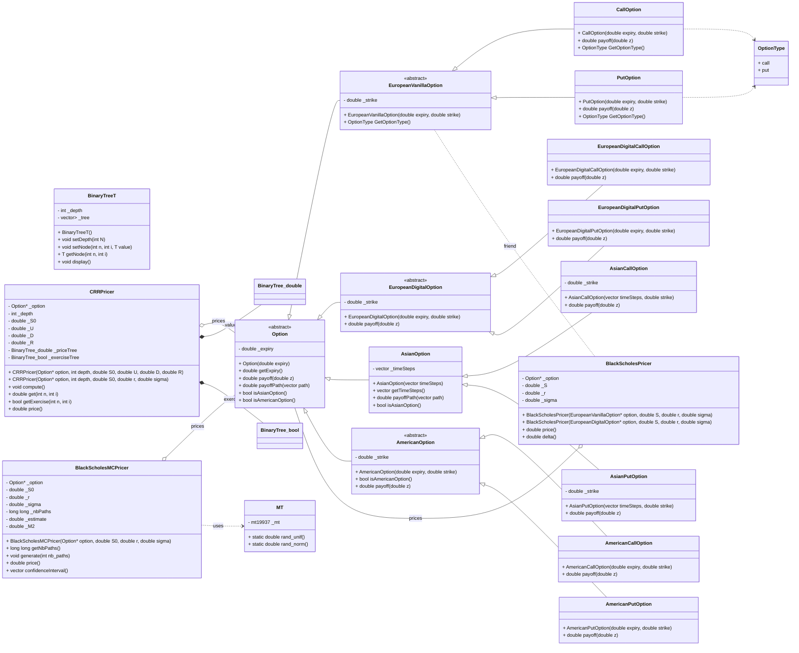

# Diagramme de classes — Projet C++ Finance

```mermaid
classDiagram
direction LR

class Option {
  <<abstract>>
  - double _expiry
  + Option(double expiry)
  + double getExpiry()
  + double payoff(double z)
  + double payoffPath(vector<double> path)
  + bool isAsianOption()
  + bool isAmericanOption()
}

class OptionType {
  + call
  + put
}

class EuropeanVanillaOption {
  <<abstract>>
  - double _strike
  + EuropeanVanillaOption(double expiry, double strike)
  + OptionType GetOptionType()
}
Option <|-- EuropeanVanillaOption

class CallOption {
  + CallOption(double expiry, double strike)
  + double payoff(double z)
  + OptionType GetOptionType()
}
class PutOption {
  + PutOption(double expiry, double strike)
  + double payoff(double z)
  + OptionType GetOptionType()
}
EuropeanVanillaOption <|-- CallOption
EuropeanVanillaOption <|-- PutOption

class EuropeanDigitalOption {
  <<abstract>>
  - double _strike
  + EuropeanDigitalOption(double expiry, double strike)
  + double payoff(double z)
}
Option <|-- EuropeanDigitalOption

class EuropeanDigitalCallOption {
  + EuropeanDigitalCallOption(double expiry, double strike)
  + double payoff(double z)
}
class EuropeanDigitalPutOption {
  + EuropeanDigitalPutOption(double expiry, double strike)
  + double payoff(double z)
}
EuropeanDigitalOption <|-- EuropeanDigitalCallOption
EuropeanDigitalOption <|-- EuropeanDigitalPutOption

class AsianOption {
  - vector<double> _timeSteps
  + AsianOption(vector<double> timeSteps)
  + vector<double> getTimeSteps()
  + double payoffPath(vector<double> path)
  + bool isAsianOption()
}
Option <|-- AsianOption

class AsianCallOption {
  - double _strike
  + AsianCallOption(vector<double> timeSteps, double strike)
  + double payoff(double z)
}
class AsianPutOption {
  - double _strike
  + AsianPutOption(vector<double> timeSteps, double strike)
  + double payoff(double z)
}
AsianOption <|-- AsianCallOption
AsianOption <|-- AsianPutOption

class AmericanOption {
  <<abstract>>
  - double _strike
  + AmericanOption(double expiry, double strike)
  + bool isAmericanOption()
  + double payoff(double z)
}
Option <|-- AmericanOption

class AmericanCallOption {
  + AmericanCallOption(double expiry, double strike)
  + double payoff(double z)
}
class AmericanPutOption {
  + AmericanPutOption(double expiry, double strike)
  + double payoff(double z)
}
AmericanOption <|-- AmericanCallOption
AmericanOption <|-- AmericanPutOption

class BinaryTreeT {
  - int _depth
  - vector<vector<T>> _tree
  + BinaryTreeT()
  + void setDepth(int N)
  + void setNode(int n, int i, T value)
  + T getNode(int n, int i)
  + void display()
}

class BinaryTree_double
class BinaryTree_bool

class CRRPricer {
  - Option* _option
  - int _depth
  - double _S0
  - double _U
  - double _D
  - double _R
  - BinaryTree_double _priceTree
  - BinaryTree_bool _exerciseTree
  + CRRPricer(Option* option, int depth, double S0, double U, double D, double R)
  + CRRPricer(Option* option, int depth, double S0, double r, double sigma)
  + void compute()
  + double get(int n, int i)
  + bool getExercise(int n, int i)
  + double price()
}
CRRPricer o-- Option : prices
CRRPricer *-- BinaryTree_double : values
CRRPricer *-- BinaryTree_bool : exercise

class BlackScholesPricer {
  - Option* _option
  - double _S
  - double _r
  - double _sigma
  + BlackScholesPricer(EuropeanVanillaOption* option, double S, double r, double sigma)
  + BlackScholesPricer(EuropeanDigitalOption* option, double S, double r, double sigma)
  + double price()
  + double delta()
}
BlackScholesPricer o-- Option : prices
EuropeanVanillaOption .. BlackScholesPricer : friend

class MT {
  - mt19937 _mt
  + static double rand_unif()
  + static double rand_norm()
}

class BlackScholesMCPricer {
  - Option* _option
  - double _S0
  - double _r
  - double _sigma
  - long long _nbPaths
  - double _estimate
  - double _M2
  + BlackScholesMCPricer(Option* option, double S0, double r, double sigma)
  + long long getNbPaths()
  + void generate(int nb_paths)
  + double price()
  + vector<double> confidenceInterval()
}
BlackScholesMCPricer o-- Option : prices
BlackScholesMCPricer ..> MT : uses
CallOption ..> OptionType
PutOption ..> OptionType
```
